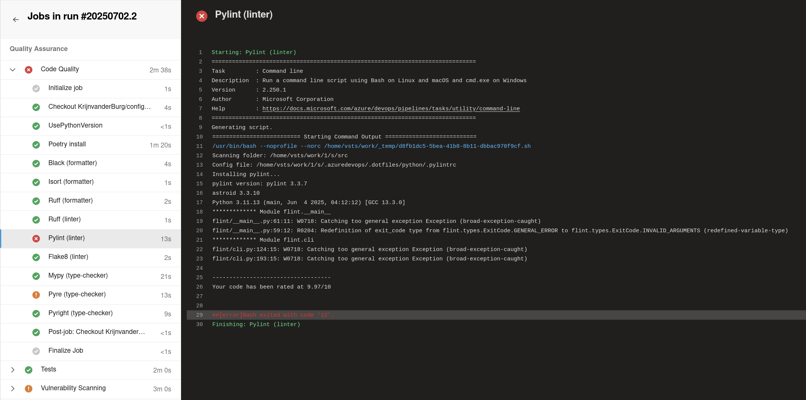

# Azure DevOps Pipeline Templates - Complete CI/CD Suite

A comprehensive collection of Azure DevOps pipeline templates providing enterprise-grade CI/CD capabilities for multiple technologies. This repository contains reusable, modular pipeline templates designed to standardize and accelerate DevOps workflows across organizations.



## 🚀 Why Use These Pipeline Templates?

### Near-Zero Configuration CI/CD Pipelines
These Azure DevOps templates provide fully configured CI/CD pipelines with industry best practices built-in, ensuring consistent, secure, and reliable deployments across your entire organization. No more reinventing the wheel or lengthy pipeline setup procedures.

### Comprehensive Tool Integration
This template collection includes 25+ carefully curated industry-standard development tools, primarily for Python, across multiple categories:

- **🎨 Code Formatters**: Ruff, Black, isort - Ensure consistent code style across teams
- **🔍 Linters & Analyzers**: Pylint, Flake8, Ruff Linter - Catch bugs and enforce best practices
- **🔒 Type Checkers**: Mypy, Pyright, Pyre - Prevent type-related errors before deployment
- **🛡️ Security Scanners**: Bandit, Semgrep, DevSkim - Identify vulnerabilities and security issues
- **🔐 Secret Detection**: Gitleaks, TruffleHog - Prevent credential leaks in repositories
- **📦 Dependency Analysis**: OWASP Dependency Check, OSSAudit - Monitor third-party package vulnerabilities
- **🧪 Testing & Coverage**: Pytest with Coverage.py - Ensure code reliability and test completeness
- **📚 Documentation**: Sphinx - Generate professional documentation automatically
- **🏗️ Infrastructure**: OpenTofu/Terraform - Infrastructure as Code deployment and validation

> **💡 Perfect Local-Remote Consistency:** These CI/CD templates use the same configurations as the [DevContainer environments](https://github.com/KrijnvanderBurg/.devcontainer). Test your pipeline changes locally with identical tool execution — when local checks pass, remote execution is guaranteed to pass too.

### Modular Architecture Design

#### Two-Layer Template Architecture
This implementation uses a modular two-tier architecture for maximum reusability and maintainability:

1. **Atomic Templates** - Single-purpose, focused templates for individual tools
2. **Composite Templates** - Combine related atomic templates for common workflows

Once the templates are integrated, you can use them directly in your pipelines. The key advantage of this approach is abstraction: for example, if your pipeline references a `linter` template, you can update or swap out the underlying implementation of the linter without modifying any consuming pipelines, as long as the expected parameters remain consistent. This ensures that all dependent pipelines benefit from updates or improvements instantly, with no required changes to their configuration.

> **🚀 Want to see these pipelines in action locally?** The [DevContainer environments](https://github.com/KrijnvanderBurg/.devcontainer) run the exact same tools with identical configurations — perfect for testing pipeline changes before committing. **10x more detail** on local-remote consistency and zero-config development environments.

## 🏁 Getting Started

### Quick Installation

1. **🍴 Create Templates Repository**: 
   - **Option A**: Fork [`KrijnvanderBurg/.azuredevops`](https://github.com/KrijnvanderBurg/.azuredevops) to your organization
   - **Option B**: Use my repository directly in step 3

2. **📥 Add .azuredevops as submodule**
   ```bash
   git submodule add https://github.com/KrijnvanderBurg/.azuredevops.git .azuredevops
   git submodule update --init --recursive
   ```

   > **Important**: The `--recursive` flag is required for nested submodules. The [`.dotfiles`](https://github.com/KrijnvanderBurg/.dotfiles) directory is a submodule containing shared configuration files.

3. **📦 Create your pipeline file** (`azure-pipelines.yml` in repository root):
   ```yaml
   trigger:
     - main

   resources:
     repositories:
       - repository: templates
         type: git
         name: KrijnvanderBurg/.azuredevops  # Reference from step 1

   extends:
     template: v1/pipelines/devops_toolkit.yaml@templates
     parameters:
       pythonVersion: 3.11
       pythonSrcDirectory: $(Build.Repository.LocalPath)/src
       pythonTestsDirectory: $(Build.Repository.LocalPath)/tests
   ```

4. **🚀 Commit and Push** - Azure DevOps automatically detects and runs your pipeline

5. **⚡ Verify Setup** - Check that pipeline runs and all quality gates pass

### 🔍 Why External Repository Reference is Required

Azure DevOps cannot see inside submodules when creating pipelines - it will only see the submodule URL reference and not the files.

**Solution**: Reference the root template as external repository (`@templates`), not as local file.

#### Our Submodule Approach (Recommended)
```yaml
resources:
  repositories:
    - repository: templates
      type: git  
      name: KrijnvanderBurg/.azuredevops

extends:
  template: v1/pipelines/devops_toolkit.yaml@templates
```

**Benefits:**
- **Single Reference**: Only need `@templates` once for main pipeline
- **Internal Templates**: Templates inside submodule reference each other directly 
- **Unified Structure**: All files in expected locations after checkout
- **See Example**: [`devops_toolkit.yaml`](https://github.com/KrijnvanderBurg/.azuredevops/blob/main/v1/pipelines/devops_toolkit.yaml) uses internal references without `@templates`

#### Alternative Approach (Not Recommended)
```yaml
resources:
  repositories:
    - repository: templates
      type: git
      name: KrijnvanderBurg/Templates
    - repository: configs  
      type: git
      name: KrijnvanderBurg/Configurations

steps:
- checkout: templates
- checkout: configs  
- checkout: self
```

**Problems:**
- Multiple repository references required
- Files scattered across different agent directories
- Complex path management
- Harder maintenance


## 📁 Repository Structure

```bash
.azuredevops/
├── v1/                              # Current stable version
│   ├── pipelines/                     # Complete end-to-end pipeline definitions
│   │   ├── devops_toolkit.yaml          # Python project CI/CD pipeline
│   │   ├── flint.yaml                   # Advanced Python project pipeline
│   │   └── data-platform.yaml          # Data platform specific pipeline
│   ├── templates/                     # Reusable pipeline templates
│   │   ├── atomic/                      # Single-purpose atomic templates
│   │   │   ├── python/                    # Python tooling (25+ tools)
│   │   │   ├── opentofu/                  # OpenTofu/Terraform operations
│   │   │   ├── azuredevops/               # Azure DevOps utilities
│   │   │   └── git/                       # Git operations with submodules
│   │   ├── composite/                   # Multi-tool workflow templates
│   │   │   ├── python/                    # Python quality gates & workflows
│   │   │   └── opentofu/                  # Infrastructure deployment workflows
│   │   └── solution/                    # Complete project lifecycle templates
│   │       └── python/                    # Full Python CI/CD solution
│   ├── scripts/                       # Helper scripts and utilities
│   │   ├── python/                        # Python automation scripts
│   │   ├── powershell/                    # PowerShell utilities
│   │   └── shell/                         # Shell script utilities
│   └── variables/                     # Centralized variable management
│       ├── shared.yml                     # Cross-project shared variables
│       └── environments/                  # Environment-specific configurations
│           ├── dev.yml                      # Development environment
│           └── prod.yml                     # Production environment
├── v2/                              # Next generation (in development)
```


## 🛠️ Complete Template Reference

### 🐍 Python Development Templates

#### Atomic Templates (Single-Purpose)

**Formatters**
- **Ruff Formatter** <sup>[Docs](https://docs.astral.sh/ruff/) | [Template](v1/templates/atomic/python/ruff-formatter.yaml)</sup> - Lightning-fast Python formatter written in Rust. **Primary recommendation** for modern Python development.
- **Black** <sup>[Docs](https://black.readthedocs.io/) | [Template](v1/templates/atomic/python/black.yaml)</sup> - The uncompromising Python code formatter.
- **isort** <sup>[Docs](https://pycqa.github.io/isort/) | [Template](v1/templates/atomic/python/isort.yaml)</sup> - Sorts Python imports alphabetically and separates them into sections.

**Linters & Code Quality**
- **Ruff Linter** <sup>[Docs](https://docs.astral.sh/ruff/) | [Template](v1/templates/atomic/python/ruff-linter.yaml)</sup> - Extremely fast linter with 800+ rules. **Primary recommendation** for comprehensive code quality checks.
- **Pylint** <sup>[Docs](https://pylint.org/) | [Template](v1/templates/atomic/python/pylint.yaml)</sup> - Comprehensive static code analyzer that checks for errors and enforces coding standards.
- **Flake8** <sup>[Docs](https://flake8.pycqa.org/) | [Template](v1/templates/atomic/python/flake8.yaml)</sup> - Combines pycodestyle, pyflakes, and mccabe to check code style and quality.
- **Vulture** <sup>[Docs](https://github.com/jendrikseipp/vulture) | [Template](v1/templates/atomic/python/vulture.yaml)</sup> - Finds unused code in Python programs.

**Type Checkers**
- **Mypy** <sup>[Docs](https://mypy-lang.org/) | [Template](v1/templates/atomic/python/mypy.yaml)</sup> - Optional static type checker for Python.
- **Pyright** <sup>[Docs](https://microsoft.github.io/pyright) | [Template](v1/templates/atomic/python/pyright.yaml)</sup> - Fast, standards-based static type checker.
- **Pyre** <sup>[Docs](https://pyre-check.org/) | [Template](v1/templates/atomic/python/pyre.yaml)</sup> - Facebook's performant type checker for large codebases.

**Security & Vulnerability Scanners**
- **Bandit** <sup>[Docs](https://bandit.readthedocs.io) | [Template](v1/templates/atomic/python/bandit.yaml)</sup> - Scans Python code for common security issues.
- **Semgrep** <sup>[Docs](https://semgrep.dev/p/python) | [Template](v1/templates/atomic/python/semgrep.yaml)</sup> - Fast static analysis for finding bugs and security vulnerabilities.
- **DevSkim** <sup>[Docs](https://github.com/microsoft/DevSkim) | [Template](v1/templates/atomic/python/devskim.yaml)</sup> - Microsoft's security analysis framework.
- **Graudit** <sup>[Github](https://github.com/wireghoul/graudit) | [Template](v1/templates/atomic/python/graudit.yaml)</sup> - Grep-based source code auditing tool.

**Secrets & Credentials Detection**
- **TruffleHog** <sup>[Github](https://github.com/trufflesecurity/trufflehog) | [Template](v1/templates/atomic/python/trufflehog.yaml)</sup> - Searches repositories for high-entropy strings and secrets.
- **Gitleaks** <sup>[Github](https://github.com/gitleaks/gitleaks) | [Template](v1/templates/atomic/python/gitleaks.yaml)</sup> - SAST tool for detecting hardcoded secrets.

**Dependency Analysis**
- **OSSAudit** <sup>[Github](https://github.com/illikainen/ossaudit) | [Template](v1/templates/atomic/python/ossaudit.yaml)</sup> - Uses Sonatype OSS Index to audit Python packages for vulnerabilities.
- **OWASP Dependency Check** <sup>[Docs](https://owasp.org/www-project-dependency-check/) | [Template](v1/templates/atomic/python/owasp.yaml)</sup> - Software Composition Analysis tool for detecting vulnerabilities in dependencies.

**Testing & Coverage**
- **Pytest** <sup>[Docs](https://docs.pytest.org) | [Template](v1/templates/atomic/python/pytest.yaml)</sup> - The pytest framework with coverage reporting.
- **Pytest Split** <sup>[Template](v1/templates/atomic/python/pytest-split.yaml)</sup> - Run tests in parallel across multiple agents for faster execution.
- **Pytest Diff** <sup>[Template](v1/templates/atomic/python/pytest-diff.yaml)</sup> - Run only tests affected by code changes.

**Dependency Management & Packaging**
- **Poetry Install** <sup>[Docs](https://python-poetry.org/) | [Template](v1/templates/atomic/python/poetry-install-pyproject.yaml)</sup> - Install dependencies using Poetry and pyproject.toml.
- **Pip Install Requirements** <sup>[Template](v1/templates/atomic/python/pip-install-requirements.yaml)</sup> - Install dependencies from requirements.txt.
- **Pip Install Editable** <sup>[Template](v1/templates/atomic/python/pip-install-editable.yml)</sup> - Install package in editable/development mode.
- **Python Build Wheel** <sup>[Docs](https://build.pypa.io) | [Template](v1/templates/atomic/python/build-wheel-bdist.yaml)</sup> - Build Python packages using the build frontend.
- **Twine Upload** <sup>[Docs](https://twine.readthedocs.io) | [Template](v1/templates/atomic/python/twine-upload.yml)</sup> - Upload Python packages to PyPI.

**Documentation**
- **Sphinx** <sup>[Docs](https://www.sphinx-doc.org/) | [Template](v1/templates/atomic/python/sphinx.yaml)</sup> - Generate professional documentation.

**Metadata Extraction**
- **PyProject Extract Metadata** <sup>[Template](v1/templates/atomic/python/pyproject-extract-metadata.yaml)</sup> - Extract version, name, and metadata from pyproject.toml.

#### Composite Templates (Multi-Tool Workflows)

- **Formatter Workflow** <sup>[Template](v1/templates/composite/python/formatter.yaml)</sup> - Combines Ruff Formatter, Black, and isort for complete code formatting.
- **Linter Workflow** <sup>[Template](v1/templates/composite/python/linter.yaml)</sup> - Runs Ruff Linter, Pylint, and Flake8 for comprehensive code quality analysis.
- **Type Checking Workflow** <sup>[Template](v1/templates/composite/python/typechecking.yaml)</sup> - Executes Mypy, Pyright, and Pyre for complete type validation.
- **1st Party Vulnerability Scanning** <sup>[Template](v1/templates/composite/python/scanning_1st_vulnerabilities.yaml)</sup> - Scans your source code with Bandit, Semgrep, DevSkim, and Graudit.
- **3rd Party Vulnerability Scanning** <sup>[Template](v1/templates/composite/python/scanning_3rd_vulnerabilities.yaml)</sup> - Analyzes dependencies with OSSAudit and OWASP Dependency Check.
- **Documentation Generation** <sup>[Template](v1/templates/composite/python/documentation.yaml)</sup> - Complete documentation workflow with Sphinx.

#### Solution Templates (Complete CI/CD)

- **Python CI Pipeline** <sup>[Template](v1/templates/solution/python/python-ci.yaml)</sup> - Complete CI/CD pipeline including:
  - Quality Assurance stage (formatters, linters, type checkers)
  - Testing stage (pytest with coverage)
  - Vulnerability Scanning stage (security analysis)

### 🛠️ Infrastructure (OpenTofu/Terraform) Templates

#### Atomic Templates

- **OpenTofu Install** <sup>[Template](v1/templates/atomic/opentofu/opentofu-install.yaml)</sup> - Install OpenTofu binary for pipeline execution.
- **OpenTofu Init** <sup>[Template](v1/templates/atomic/opentofu/opentofu-init.yaml)</sup> - Initialize OpenTofu working directory.
- **OpenTofu Validate** <sup>[Template](v1/templates/atomic/opentofu/opentofu-validate.yaml)</sup> - Validate OpenTofu configuration files.
- **OpenTofu Plan** <sup>[Template](v1/templates/atomic/opentofu/opentofu-plan.yaml)</sup> - Create OpenTofu execution plan.
- **OpenTofu Apply** <sup>[Template](v1/templates/atomic/opentofu/opentofu-apply.yaml)</sup> - Apply OpenTofu configuration changes.

#### Composite Templates

- **Validate & Plan** <sup>[Template](v1/templates/composite/opentofu/validate_and_plan.yml)</sup> - Complete validation and planning workflow.
- **Apply Infrastructure** <sup>[Template](v1/templates/composite/opentofu/apply.yml)</sup> - Full infrastructure deployment workflow.

### 🔄 Azure DevOps Utilities

- **Promote Artifact** <sup>[Template](v1/templates/atomic/azuredevops/promote-artifact.yaml)</sup> - Promote artifacts between environments or feeds.
- **PR Comment** <sup>[Template](v1/templates/atomic/azuredevops/pr-comment.yaml)</sup> - Add automated comments to pull requests.

### 📂 Git Operations

- **Checkout** <sup>[Template](v1/templates/atomic/git/checkout.yaml)</sup> - Standard git checkout with optimizations.
- **Checkout with Submodules** <sup>[Template](v1/templates/atomic/git/checkout-with-submodules.yaml)</sup> - Git checkout with recursive submodule initialization.


## 🏗️ Architecture: Shared Configuration Submodule `.dotfiles`

This Azure DevOps repository uses a **nested [`.dotfiles`](https://github.com/KrijnvanderBurg/.dotfiles) submodule architecture** to ensure **100% consistency** between local development environments and CI/CD pipelines.

### Why Nested Submodules?

The `.dotfiles` directory is itself a Git submodule that contains:
- **Configuration files** for all development tools (linters, formatters, type checkers, security scanners)
- **Shell scripts** that execute each tool with identical parameters and settings
- **Shared standards** across multiple environments

### Consistency Across Environments

This same `.dotfiles` submodule is used by **other DevOps components**:

- **[`.devcontainer`](https://github.com/krijnvanderburg/.devcontainer)** - Local development environments
- **`.azuredevops`** (this repository) - CI/CD pipeline templates and automation
- `...` other future submodules

### Benefits of This Architecture

🎯 **Identical Tool Execution**: The exact same shell script runs both locally in DevContainers and in CI/CD pipelines  
🔒 **Configuration Consistency**: All environments use identical configuration files for every tool  
🚀 **Quality Gate Confidence**: If a tool passes locally, it will pass in CI/CD (and vice versa)  
⚡ **Single Source of Truth**: Update tool configurations once, apply everywhere  
🛠️ **Easier Maintenance**: Modify scripts and configs in one place, benefit all environments  

### How It Works: Pylint Example
When the CI/CD pipeline (Azure DevOps template) runs a tool, it uses the script and config file from `.dotfiles`:
```js
// Example Azure Devops pipeline step
steps:
- script: |
    //               The Nested Submodule .dotfiles  ⤵
    sh $(Build.Repository.LocalPath)/.azuredevops/.dotfiles/python/scripts/pylint.sh \ // ← Same script
      $(Build.Repository.LocalPath)/src \                                            // ← Same dirpath
      --config $(Build.Repository.LocalPath)/.azuredevops/.dotfiles/python/.pylintrc // ← Same config
  displayName: Pylint (linter)
  ...
```

When you run the same tool locally in VS Code it uses the same script and config file from `.dotfiles`:
```json
// VS Code Task
{
   "label": "pylint",
   //              The Nested Submodule .dotfiles  ⤵
   "command": "${workspaceFolder}/.devcontainer/.dotfiles/python/scripts/pylint.sh", // ← Same script
   "args": [
      "${workspaceFolder}/src",                                                 // ← Same target dirpath
      "--config ${workspaceFolder}/.devcontainer/.dotfiles/python/.pylintrc"   // ← Same config file
   ]
}
```

This ensures that **quality gates in CI/CD match your local experience exactly**; eliminating the need to wait for CI/CD runs to see if code conforms to quality standards.


## 📞 Support & Troubleshooting

**"Why can't I directly reference templates?"**
```
Error: Template reference './azuredevops/v1/templates/...' not found
```
This is expected! Azure DevOps only sees the submodule URL, not its contents, when creating pipelines. Try it yourself: open the repository remote on github and open the submodule file, it only includes a git reference, not the actual files. The submodule must be explicitly cloned also, which Azure DevOps does not do when creating a pipeline in the UI.
- **Solution**: Use `@templates` repository reference (see examples above)
- **Why**: During execution, templates automatically checkout submodules with correct structure

**Configuration File Not Found**
```  
Error: Configuration / script file not found: ...
```
Ensure git checkout includes submodules:
```yaml
- checkout: self
  submodules: recursive
```

---

## 🚀 Ready to Experience the Full Workflow?

**Complete Integration:** Explore the [main DevOps Toolkit](https://github.com/KrijnvanderBurg/DevOps-Toolkit) to understand how DevContainers, CI/CD templates, and shared configurations work together as a **unified DevOps solution**.

**Local Development First:** Start with the [DevContainer environments](https://github.com/KrijnvanderBurg/.devcontainer) to experience the same tools locally with zero configuration. **Perfect consistency** means when your local checks pass, your CI/CD will pass too.

**Understand the Architecture:** Dive deep into the [shared configuration strategy](https://github.com/KrijnvanderBurg/.dotfiles) that makes local-remote consistency possible. See how **one script, one config** powers both environments.

